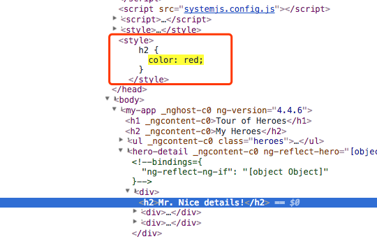

# shadow dom和Angular2

###### seraphwu


## 本文要讲什么
* 了解 ```shadow dom```。
	* 如何支持与查看 ```shadow dom```。
	* 组件化后，怎么限制样式作用域。
	* 怎么提升了网页性能。

* 关心Angular2中怎么使用shadow dom。
	* 默认是模拟 ```shadow dom```，而未使用原生能力。
	* 怎么使用 ```shadow dom``` 原生能力。

## shadow dom：概念

* ```Shadow DOM``` 是Web Components规范中的一个组成部分，主要作用是提供DOM、样式、脚本的封装。
* 例子：
	* 在w3c的video例子中：[http://www.w3school.com.cn/tiy/t.asp?f=html5_video](http://www.w3school.com.cn/tiy/t.asp?f=html5_video)
	* 看下video只是一个的标签。

		

	* 开启 shadow dom 查看能力后，video标签下出现一大堆内容。

		
		
* Shadow DOM 就是这样，你看起来只是一个元素，其实他还有很多孙子。


## shadow dom：创建
* Api: [element.createShadowRoot()](https://developer.mozilla.org/en-US/docs/Web/API/Element/createShadowRoot)
	
	```js
	var host = document.querySelector('.host');  
	var root = host.createShadowRoot();  
	  
	var node = document.createElement('h1');  
	node.textContent = 'Shadow DOM 介绍';  
	  
	var para = document.createElement('p');  
	para.textContent = 'Shadow DOM 详细信息';  
	  
	root.appendChild(node);  
	root.appendChild(para);  
	
	```
	
* 效果

	

## shadow dom：调试
* 默认 chrome 中无法查看到 shadow dom。
* 开启方式：
	* 在开发者模式下 => 设置 => General => Show user agent shadow DOM ，勾选上。

		
		
	* 刷新页面，再去选择dom，就可以查看到了。
	* shadow dom 的根部都带有一个标签 #shadow-root (user-agent)

		

## shadow dom：浏览器支持情况
* 上 [can i use](http://www.caniuse.com/#search=shadow%20dom) 看下:

	
	
* 我们的项目是运行在手机上的，所以比较关心 IOS Safari 和 Android Browser。
* 运行环境怎么判断是否支持呢？

	```js
	const CAN_SHADOW = !!(document.head.attachShadow ||
	 document.head.createShadowRoot);
	 
	```


## Angular2项目中怎么没看到 #shadow-root
* 听说Angular2使用了shadow dom，怀着期待的心情，在调试器中看Angular2的项目dom。
	* 项目地址:[https://angular.cn/generated/live-examples/toh-pt6/eplnkr.html](https://angular.cn/generated/live-examples/toh-pt6/eplnkr.html)
	* 却没看到 #shadow-root (已经打开chrome调试shadow dom能力)

		
		
	* 说好的要跟 React 的 ```Vurtual DOM``` 比快的！

* 原来，Angular2 的默认配置是 ```ViewEncapsulation.Emulated```
	* 即 模拟 ```shadow dom```。
	* 假的 ```shadow dom```，fake。
	* 如果要运用真的 ```shadow dom```，需要配置 ```ViewEncapsulation.Native```
	* 配置说明的地址:[https://angular.io/api/core/ViewEncapsulation](https://angular.io/api/core/ViewEncapsulation)

* 至于 ```ViewEncapsulation``` 的各个枚举类型的意义，下文会细细说来。

## Component级别的配置
* 若要 chrome 中调试时显示出 ```#shadow-root```
	* 即 使用原生的 ```shadow dom``` 能力
	* 即 让Angular不使用默认的 ```Emulated``` 。
	* 可以在Component的元数据上进行配置，代码与效果如下：

	
	
* ```Component``` 的API介绍里，有提到这个接口：[https://angular.cn/api/core/Component](https://angular.cn/api/core/Component)

## 全局配置
* 显然，我如果要用 ```shadow dom``` 能力，不至于每个 ```Component``` 去配置。
	* 哪里可以配置默认的 ```shadow dom``` 实现类型呢。
	* 这里，在启动函数中
	
		```js
		import { enableProdMode , ViewEncapsulation} from '@angular/core';
		import { platformBrowserDynamic } from '@angular/platform-browser-dynamic';
		
		import { AppModule } from './app/app.module';
		
		platformBrowserDynamic().bootstrapModule(AppModule, [
		    {	//这里配置全局使用 原生 shadow dom 能力。
		        defaultEncapsulation: ViewEncapsulation.Native
		    }
		]);
		
		```
		
* 考虑到浏览器兼容问题，还要做个判断

	```js
	//判断是否支持 原生的 shadow dom
	const CAN_SHADOW = !!(document.head.attachShadow || document.head.createShadowRoot);
	let config = CAN_SHADOW ? [
	    {	//这里配置全局使用 原生 shadow dom 能力。
	        defaultEncapsulation: ViewEncapsulation.Native
	    }
	] : null
	
	platformBrowserDynamic().bootstrapModule(AppModule, config);
	
	```
	
## 承上启下
* 上文说到 Angular了用了 模拟的 ```shadow dom```。
* 可以通过配置来 使用原生的 ```shadow dom```。
* 这个配置就是 ```ViewEncapsulation```：
	* ```ViewEncapsulation.None```  :寻常方式处理组件，样式被直接塞到head标签中。
	* ```ViewEncapsulation.Emulated```  :模拟shadow dom能力，会修改样式的名称。
	* ```ViewEncapsulation.Native``` :使用原生的shadow dom能力。
* 下面以Angular2新手项目为例子为基础，看下三种配置下的能力表现。
	* [https://angular.cn/generated/live-examples/toh-pt3/eplnkr.html](https://angular.cn/generated/live-examples/toh-pt3/eplnkr.html)
	* 该例子包括一个组件 ```app.component.ts``` ，其template中有个h2标签。
	* 这个组件有个子组件 ```hero-detail.component.ts``` ,其template中也有个h2标签。
	* 下述例子主要修改 ```hero-detail.compoent``` 中的样式，看是否会影响到父组件。


## ViewEncapsulation.None
* 如下图
	* 配置 ```ViewEncapsulation.None```。
	* h2 样式写在 子组件里，却影响到父组件，字体变红。

		

* 调试看看
	* 子组件里面的样式，被添加到head中去，故对全局都产生影响

	
	
* 所以，配置None ，完全未对组件内的样式进行封装，污染到了全局。
				
## ViewEncapsulation.Emulated
* 如下图
	* 配置 ```ViewEncapsulation.Emulated```。
	* h2 样式写在 子组件里，未影响到父组件。

		
		
* 调试看看
	* 子组件里面的样式，虽然被添加到head中取了，但是增加了唯一标示。
	* 同理，组件应用样式的位置，也增加了唯一标示，不在污染组件之外的样式。

	

* 所以，可以理解Emulate了，即模拟了组件化的实现。
	* 如果是class 方式的样式，同样会被做重命名。
	* webpack有个插件，可模拟此类操作，实现样式的组件化。

## ViewEncapsulation.Native
* 如下图
	* 配置 ```ViewEncapsulation.Native```。
	* h2 样式写在 子组件里，未影响到父组件。

		
		
* 调试看看
	* 这是原生的shadow dom支持，我们看到了 ```#shadow-root``` 标签。
	* 样式直接被添加到 dom里面，不会污染到外边。

	


## shadow dom 怎么提升性能了
* ```shadow dom``` 主要能力在于封装与重用：
	* 重用，提升开发效率。
	* 封装，减少样式冲突的出错概率。
* 上文的例子主要解释样式上的封装，```shadow dom``` 更重要的是重绘也因为封装，被局限在dom上了。
	* 网页性能大瓶颈在页面dom变化的重绘上。
	* 即，如果变化发生在组件内部，只需要重绘组件dom，而不用重绘整个页面。
	* 当然，如果有必要，也是要重绘整个页面的。


## 总结
* 之所以了解 ```shadow dom```，是因为react 的 ```virtual dom```。
	* 要比快不是。
	* 但是默认Angular2 是未使用shadow dom的性能提升能力的，如果要比快，记得开启 Native能力。
* Angular2 使用脏检查来减少dom绘制次数，用shadow dom来减少绘制区域。
* 为什么默认Angular2 不用原生shadow dom能力呢，有坑？