# webstorm 调试js,node,webpack

###### seraphwu@20171103

## 背景
* 初衷是希望做 ```webpack``` 深度优化。
	* 于是希望看下 ```webpack``` 的运行机制。
	* 如果能够调试 ```webpack``` 代码，岂不是更直观。
* 于是看到 ```webpack-webstorm-debugger-script``` 说可以调试 ```loader``` 和```plugins```，实际调试发现，也能调试 ```webpack``` 本身的逻辑代码。
	* 才发现 ```webstorm``` 的调试能力不止于此。
	* 学习过程还遇到个坑。
* 顺便整理出来。


## 调试html：安装插件
* [https://chrome.google.com/webstore/detail/jetbrains-ide-support/hmhgeddbohgjknpmjagkdomcpobmllji](https://chrome.google.com/webstore/detail/jetbrains-ide-support/hmhgeddbohgjknpmjagkdomcpobmllji)
* 这是个 ```chrome``` 浏览器的插件。如果不能翻墙，安装不了，就看看罢了。
* 安装插件后，```chrome``` 右上角出现插件  ```JB```

	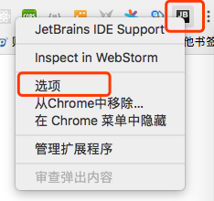
	
* 点击选项，会看到其基本配置，是自动生成的，会与``` webstorm``` 自动关联配置，不用人工管理。

	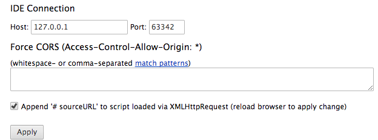

## 调试html：webstorm配置
* 选择 ```Edit Configurations```
	
	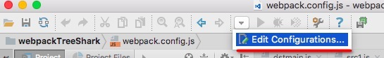
	
* 如果没看到工具栏，则选择 ```view ->Toobar``` 勾选上就有了
* 点击 ```Edit Configurations``` 后， 新增 ```JavaScript Debug``` 模板。
	
	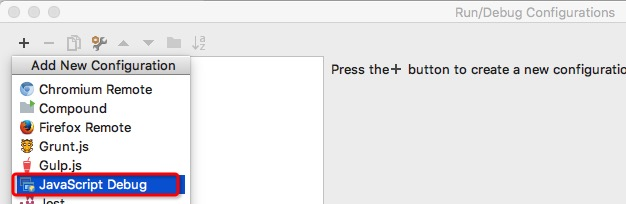
	
* 填写 模板名称 ，选择调试的html的目的地址，选择使用的浏览器。

	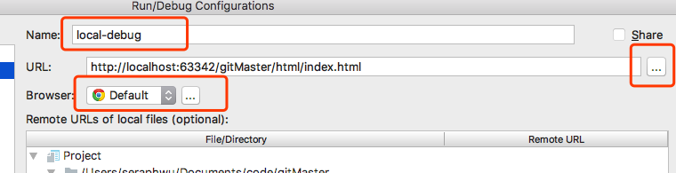

## 调试html：开始调试
* 完成配置后，在代码中断点
	
	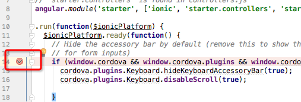
	
* 在 ```webstorm``` 工具栏中点击调试

	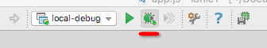
	
* 在 ```Debugger``` 栏中可以查看断点信息

	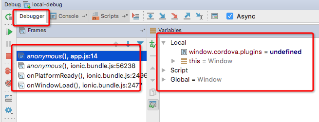
	
* 在编辑器的代码中也可以查看调试信息

	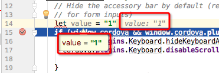
	

## 调试node
* 点击 ```Edit Configurations``` 后，新增 ```Node.js``` 模板
* 配置 模板名称， node地址， 环境地址， 目的js

	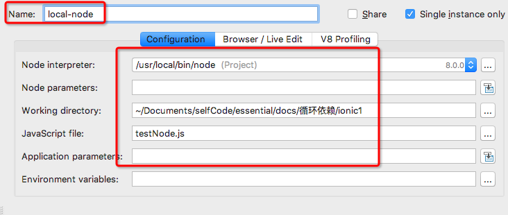
	
* 在js代码中断点， 选择该node模板，点击调试

	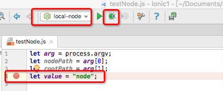
	
* ```Debugger``` 中看调试信息

	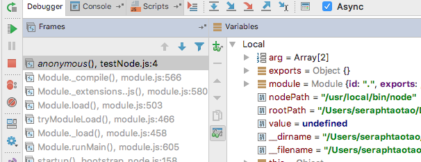

* 编辑器中看调试信息

	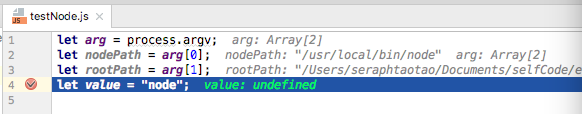

## 调试webpack
* 安装插件 [webpack-webstorm-debugger-script](https://github.com/philipshurpik/webpack-webstorm-debugger-script)
	* ```npm i webpack-webstorm-debugger-script```
* 点击 ```Edit Configurations``` 后，新增 ```Node.js``` 模板
* 配置 ```webpack-webstorm-debugger-script``` 插件作为调试入口。

	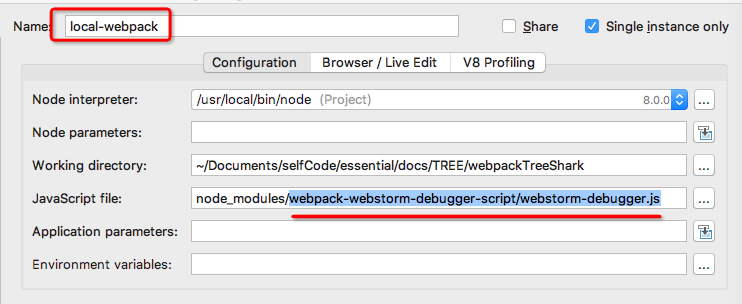

* 调试 ```plugins```
	* 本 ```webpack``` 使用了 ```uglifyjs-webpack-plugin```
	* 在 ```node_modules``` 下找到 ```uglifyjs-webpack-plugin```，并断点代码。
	* 选择配置的调试模板后，点击调试，能够断点到 ```uglifyjs-webpack-plugin``` 的代码。

	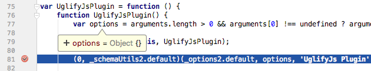
	
* 同理，找到 ```webpack``` 加载的 ```loader```，也能对立面代码做断点调试。
* 甚至，找到 ```node_modules``` 下的 ```webpack代码```，也能断点调试。
	* 想要看看 ```webpack``` 里面的执行逻辑，这是再好不过的方法了。


## 调试控制界面
* 快捷键与 ```chrome``` 有所不同，鼠标悬浮可以看到。

	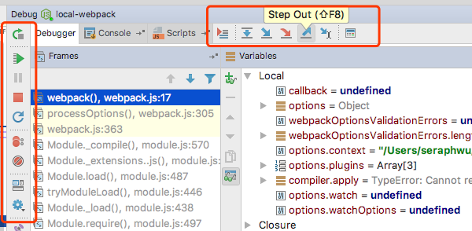


## 问题总结
* ```Edit Configurations``` 的列表中如果没有 ```Node.js```。

	* 可能是 ```plugins``` 没勾选上，打开 ```Preferences``` 配置，搜索 ```plugins```下的 ```node.js```，勾选上，重启就行。

	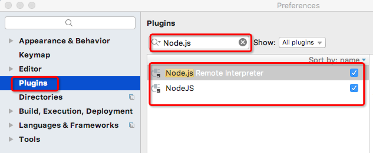
	