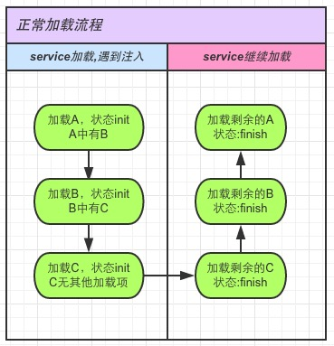
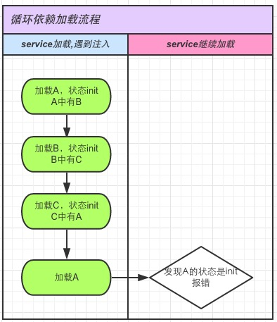

# Angular1中的循环依赖
###### seraphwu@20171011 / 20171024

## 背景
* 近期在项目中发现多处循环依赖场景: a依赖b，b依赖a。
* 立马找到相关同学，进行了修改。
* 问题是: 验证时，即使这种循环依赖存在，也不报错，项目逻辑也不影响。
* 考虑在半年前，整理过[Angular2中的循环依赖](http://km.weoa.com/group/ddb/article/1153)，故找下原因，整理成本文档。


## 我们项目中的循环依赖却不会报错的场景
* ```LocationService``` 与 ```ReportLossService``` 相互依赖
	
	```js
	//location-service.js
	class LocationService {
	  constructor() {
	  	//LocationService 依赖了 ReportLossService
	    services.inject(this, 'ReportLossService');
	  }
	
	  go() {
	    if (this.ReportLossService.xxx) {
	    }
	  }
	}
	
	app.factory('ReportLossService', ReportLossService)
	
	//report-loss-service.js
	class ReportLossService {
	  constructor() {
	  	//ReportLossService 依赖了 LocationService
	    services.inject(this, 'LocationService');
	  }
	
	  report() {
	    this.LocationService.go("report")
	  }
	}
	
	app.factory('ReportLossService', ReportLossService)

	```
	
* 据初步了解，上述 ```services.inject``` 内部实现是使用 ```$injector.get``` 来获取依赖，并赋值给 this。
	
## 难道Angular1下循环依赖不会有问题
* 如下例子验证，会必然报错（函数式写的service）
	
	```js
	angular.module('starter.services', [])
	  .factory('Test1', function (Test2) {
	    return {}
	  })
	  .factory('Test2', function (Test1) {
	    return {}
	  })
	  
	```

## 难道使用$inject.get获取依赖就不会有循环依赖问题

* 如下例子验证，也必然报错（函数式写的service）

	```js
	angular.module('starter.services', [])
	  .run(['$injector', function ($$injector) {
	      //取得注入器
		  window.injector = $$injector;
		}])
	  .factory('Test3', function () {
	    var Test4 = injector.get('Test4')
	    return {}
	
	  })
	  .factory('Test4', function () {
	    var Test3 = injector.get("Test3")
	    return {}
	  })
	  
	```

## 才发现，项目中用的是动态get，而不是构造函数中get
* 仔细看 ```service.get``` 的实现，原来该函数并非立刻获取到注入，而只是给依赖初始化getter器。 当使用依赖，或者引用依赖时，才会真正触发 ```$injector.get```。

	```js
	// 定义同名的 getter 方法
	for (let i = 1; i < serviceNames.length; ++i) {
	    let name = serviceNames[i];
	    if (Reflect.deleteProperty(self, name)) {
	        Reflect.defineProperty(self, name, makeDescriptor(name))
	    }
	}
	
	```
	
## 所以，按如下方式构造循环依赖，就不会报错了
* ```services.inject``` 里面对每个注入，做 ```getter``` 引用。
* ```services``` 初始化时，运行下述步骤1，2
	
	```js
	  .run(['$injector', function ($injector) {
	    window.services = {
	      inject: function () {
	        var self = arguments[0];
	        var getService = function (name) {
	          return $injector.get(name);
	        };
	        var makeDescriptor = function (name) {
	          return {
	            get: function () {
	              return getService(name)
	            }
	          }
	        }
	        for (var i = 1; i < arguments.length; ++i) {
	          var name = arguments[i];
	          if (Reflect.deleteProperty(self, name)) {
	            Reflect.defineProperty(self, name, makeDescriptor(name))
	          }
	        }
	      }
	    };
	  }])
	  .factory('Test5', function () {
	    services.inject(this, 'Test6')	//步骤1
	    return {								//步骤2
	      value: "Test5"
	    }
	
	  })
	  .factory('Test6', function () {
	    services.inject(this, "Test5")	//不触发执行
	    return {								//不触发执行
	      value: "Test6"
	    }
	  })
	  
	```

* 如果是其中一个service在初始化时，使用了相互依赖的另外一个service：
* 如下方式写Test5和Test6，也不会报错
* 实际代码执行过程，如下步骤1，2，3，4，5
	
	```js
	  .factory('Test5', function () {
	    services.inject(this, 'Test6')	//步骤1
	    var x = this.Test6.value;			//步骤2
	    return {								//步骤5
	      value: "Test5"
	    }
	
	  })
	  .factory('Test6', function () {
	    services.inject(this, "Test5")	//步骤3
	    return {								//步骤4
	      value: "Test6"
	    }
	  })
	  
	```

## 但是,如果循环依赖的同时，初始化时相互引用了，会报错
* 如下方式写Test5和Test6，会报错，实际代码执行过程，如下

	```js
	  .factory('Test5', function () {
	    services.inject(this, 'Test6')	//步骤1
	    var x = this.Test6.value;			//步骤2
	    return {								
	      value: "Test5"
	    }
	
	  })
	  .factory('Test6', function () {
	    services.inject(this, "Test5")	//步骤3
	    var x = this.Test5.value;			//步骤4，此时this.Test5还没初始化完，故报错
	    return {								
	      value: "Test6"
	    }
	  })
	  
	```

## 同理，使用class方式写的service，也会有上述问题

* 如下方式写 Test7 和 Test8， 不会报错

	```js
	class Test7{
	  constructor(){
	    services.inject(this, "Test8")
	    var a = this.Test8
	  }
	}
	app.factory('Test7', Test7);
	
	class Test8{
	  constructor(){
	    services.inject(this, "Test7")
	  }
	}
	app.factory('Test8', Test8);
	
	```
	
* 如下方式写的Test7 和 Test8, 会报错

	```js
	class Test7{
	  constructor(){
	    services.inject(this, "Test8")
	    var a = this.Test8
	  }
	}
	app.factory('Test7', Test7);
	
	class Test8{
	  constructor(){
	    services.inject(this, "Test7")
	    var a = this.Test7
	  }
	}
	app.factory('Test8', Test8);
	
	```
	
## 综上，循环依赖会报错的场景
* 函数式写法中，如果通过函数参数注入，一旦循环依赖，就报错
* 函数式写法中，在函数初始化时， class方式写法，在构造函数初始化时。
	* 调用 ```$injector.get```，
	* 在获取循环的依赖时，就报错

## 循环依赖报错图示
* 正常流程：

	
	
* 循环依赖流程：
	
	
	
* 我们项目使用getter方式取得注入器的调用反射，初始化时，没发生引用的操作。也谈不上循环依赖了。


## 目前项目中存在循环依赖，但没报错
* 目前我们项目

	* LocationService 是函数式写法, 通过函数参数注入 ReportLossService
	* ReportLossService 是class写法, 通过getter方式 动态注入LocationService

* 但两者都未在初始化时引用相互的依赖，故没有报错。


## 假如在ReportLossService 的构造函数中引用LocationService，则报错


	```js
	class ReportLossService {
	    constructor() {
	        services.inject(this, 'LocationService');
	        var a = this.LocationService;
	    }
	}
	
	```
	
* 再假如在LocationService 初始化时，引用ReportLossService，不会报错，因为，实际上函数参数注入，就已经引用了。只是ReportLossService 是动态注入LocationService的，初始化时，还未形成循环依赖。


## 我们能做什么
* 跟相关人沟通过，目前ReportLossService 和 LocationService 虽然理论上形成 循环依赖了。
* 但是项目没出问题，先保持现状。

## 工具来扫描
* 毕竟是个坑，规避项目中再出现此类依赖。
* 故整理了一个工具出来，扫描项目中的的循环依赖
* 项目目录下运行 npm run checkCycleDepency 即可，如有循环依赖，会如下输出。
	
	```js
	info=>: 发现循环依赖：
	LocationService -> ReportLossService -> LocationService
	ReportLossService -> LocationService -> ReportLossService

	```