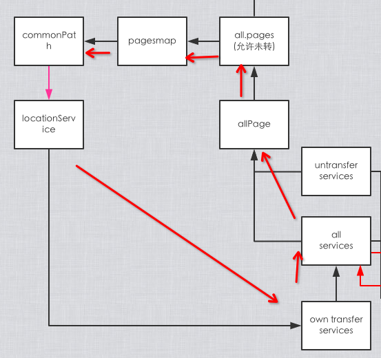
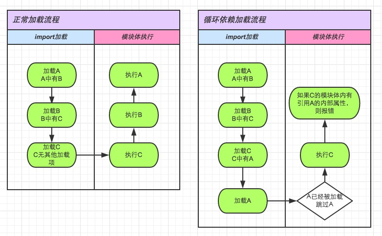
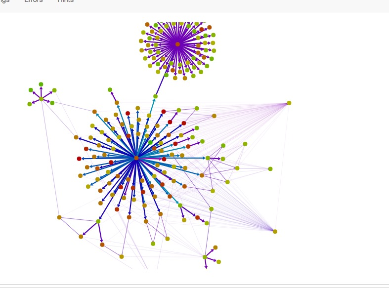

# 循环依赖与Angular2
###### seraphwu@20160311/20171024

## 背景
* 整理ionic1升级2方案过程中遇到的 路由跳转时的 循环依赖问题。


## Angular1与Angular2在服务依赖上的区别
* angular1默认未使用webpack打包，service以及controller都在module下引用，且都是单例。不会出现import类型的循环依赖。
* angular1下如果用wepack。
	1. 每个模块也只需要导入根模块(App)。
	2. 注入时通过字符串实现，无需导入具体的服务模块。
	3. 也就是说路由模块不会有循环依赖场景。 但是注入时也会有该问题
* angular2默认使用webpack。在ionic2下更是路由与注入时都不能使用字符串。
	1. 如果服务要用到页面组件，需要导入页面组件容器。
	2. 页面组件肯定要用到服务
	3. 此时的组件依赖关系是网状态的。上述两点已经导致了循环依赖的出现。

## 循环依赖场景
* 在做ionic1升级ionic2升级方案时。要在2下重写 ```commonPathService```，做统一的跳转。
	1. ```commonpath``` 需要引用所有页面组件。
	2. 页面组件需要引用 ```commonpath``` 去跳转其他组件。
	3. 此时出现循环依赖，出错。

	

* ionic2的本身为什么没这些错误？
	1. ionic2通过NavController来导航，会在每个页面注入这个服务。
	2. 那么页面A注入NavController，再引入页面B，实现跳转到B。
	3. 因为NavController不导入任何页面，所以不会有循环依赖。


## 循环依赖下怎么出的错
* 图示

	

* 关注图中的描述，是模块体执行。
	1. 如果循环注入的模块体中有使用未执行的模块，才会报错。
	2. 如果在构造函数中引用，就不会有问题了。
* 实际上，ionic2下的代码，即使在构造函数的参数中做类型定义，也会报错，为什么呢？
	
	```js
	import { PathService} from '../../providers/pathService';
	@Component({
	  selector: 'page-home',
	  templateUrl: 'home.html'
	})
	export class HomePage {
	
	  constructor(public path: PathService) {
	  }
	
	  onClick() {
	    this.path.push('HomeDetail1');
	  }
	}
	
	```

* 在我写的代码中，出现报错，可以理解，因为赋值 ```parameters``` 是在模块体重执行的。

	```js
	 import {$location} from '../../../www_I2/middle/transferService';
	class ListController {
	  constructor(location){
	  }
	}
	ListController.parameters = 
	[$location]];
	
	```

* 只能好好看看打包后的源码，便一目了然了

	```js
	var HomePage = (function () {
	  function HomePage(path) {
	    this.path = path;
	  }
	
	  HomePage.prototype.onClick = function () {
	    this.path.push('HomeDetail1');
	  };
	  HomePage = __decorate([
	  __webpack_require__.i(__WEBPACK_IMPORTED_MODULE_0__angular_core__["z" /* Component */])({
	    selector: 'page-home',template:/*ion-inline-start:"/Users/seraphtaotao/Documents/selfCode/essential/transfer1to2V5/tabV2/src/pages/home/home.html"*/''/*ion-inline-end:"/Users/seraphtaotao/Documents/selfCode/essential/transfer1to2V5/tabV2/src/pages/home/home.html"*/
	  }),
	  __metadata('design:paramtypes', [__WEBPACK_IMPORTED_MODULE_1__providers_pathService__["a" /* PathService */]])
	], HomePage);
	  return HomePage;
	  var _a;
	}());
	
	```

* 关键函数:__metadata

	```js
	var __metadata = (this && this.__metadata) || function (k, v) {
	    if (typeof Reflect === "object" && typeof Reflect.metadata === "function") return Reflect.metadata(k, v);
	};
	
	```

* 暂且不知道这个函数的意义，但是执行结果是放在 ```__decorate``` 中执行的。
* 也就是说，构造函数的静态申明会在装饰器的执行过程中，被引用。所以会出错。


##解决方案

* 使用 ```forwardRef```

	```js
	//ts下
	export class HomePage {
	
	  constructor(@Inject(forwardRef(() => PathService)) public path: PathService) {
	  }
	
	  onClick() {
	    this.path.push('HomeDetail1');
	  }
	}
	
	//js下
	ListController.parameters = 
	[[forwardRef(() => StaticData)],[forwardRef(() => $location)]];
	
	```

* 或者，将项目中的页面，都导出到全局的一个map变量中，用字符串索引（类似angular1的路由配置）。
* 然后在 ```commonPathService``` 中注入 ```NavController```，通过全局map变量，拿到要路由的页面。
* 也只是想想，这样的结构会打破angular2的设计，用 ```forwardRef``` 就行了。


##项目中如何避免

* 提供工具，输出依赖结构
	1. 比如webpack官方提供的工具[http://webpack.github.io/analyse/](http://webpack.github.io/analyse/)
	2. 执行 ```webpack --profile --json > stats.json``` 
	3. 在工具上导入json文件，可以画出依赖图

	

* 该工具只是提供图，我们需要知道循环依赖在哪里，所以，还需要找其他插件。
* 最后找到插件： [circular-dependency-plugin](https://github.com/aackerman/circular-dependency-plugin) ,可检查出循环依赖。
* 实际运行后的检测效果如下：

	```js
	WARNING in Circular dependency detected:
	another/another3.js -> src.js -> another/another.js -> another/another2.js -> another/another3.js
	
	WARNING in Circular dependency detected:
	another/another.js -> another/another2.js -> another/another3.js -> src.js -> another/another.js
	
	WARNING in Circular dependency detected:
	src.js -> another/another.js -> another/another2.js -> another/another3.js -> src.js
	
	WARNING in Circular dependency detected:
	another/another2.js -> another/another3.js -> src.js -> another/another.js -> another/another2.js
	
	```

##总结

* 实际上，angular1，服务也是不允许循环依赖的。
* 通过工具找到循环依赖
	1. 如果自己写插件
		* 从loader中去找依赖列表，最终未找到。
		* 因为loader里面没有一个参数可以表示modules的。
	2. webpack --profile输出性能文件，然后分析性能文件，是可行的。
		* 比如[webpack-cyclic-depency-checker](https://github.com/AndrewRayCode/webpack-cyclic-dependency-checker). 
		* 但是此插件适用于查看依赖图，而不检查循环依赖。
	3. 最终找到的这个插件，是个plugin: [circular-dependency-plugin](https://github.com/aackerman/circular-dependency-plugin) 能够找出循环依赖。

* 最佳实践的变量写法建议：[变量提前，字母排序](https://github.com/johnpapa/angular-styleguide/blob/master/a1/README.md)。

	```js
	var funcA = _funcA;
	var funcB = _funcB;
	
	for (var i in X) {
		funcA();
		funcB();
	}
	
	function _funcA() {
	}
	
	function _funcB() {
	}
	
	```
