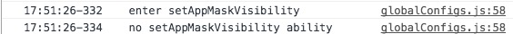
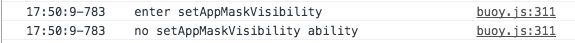

#非破坏性hook
######小明@20161218######

##背景
1. 项目开发中，希望console输出更多内容，会考虑重写它。
2. 调试工具，通常通过重写console，来实现log日志的获取。

##通常hook方式
1. tracelog，输出详细日志。

```

/**
 * 输出日志
 *
 * 支持格式化输出:
 * %s - string
 * %d or %f - number
 * %o or %O - Object
 *
 * 示例:
 * tracelog('name:%s, age:%d, birthday:%O', 'aa', 23, new Date());
 *
 * @param {string} str
 */
var tracelog = function (str /*, args*/) {
    var now = new Date();
    var timeStr = now.toLocaleTimeString()

    // 支持 console.log 的格式化输出
    var args = Array.prototype.slice.call(arguments, 1);
    console.log.apply(console, ["%s    " + str, timeStr].concat(args));

};

```

2. 获取console参数。

```

//hook函数
var log = function (msgs, type) {
    //
};

// 仅拦截 console 部分方法, 未涉及到的方法保持不变
['log', 'error', 'warn', 'debug', 'info'].forEach(function (item) {
    var oldMethod = console[item];
    console[item] = function () {
        oldMethod.apply(console, [].slice.call(arguments));
        log(arguments, item)
    }
});
```

3. 破坏性表现在：

本来打印在globlConfigs.js下执行的log打印



因为在buoy工具里，重写了console，所以显示在buoy.js下。




##非破坏性hook

```

var log = function (msgs, type) {

}
var oldConsole = console;
var handle = {
    apply: function (target, ctx, args) {
        log(args, target);
        return Reflect.apply(target, ctx, args);
    }
};

console.log = new Proxy(oldConsole.log, handle);

console.log('12');
```

##兼容处理

因为应用了ES6的新特性，所以，使用前还需要做些兼容判断

```
if (Reflect && Proxy) {
    
}
```